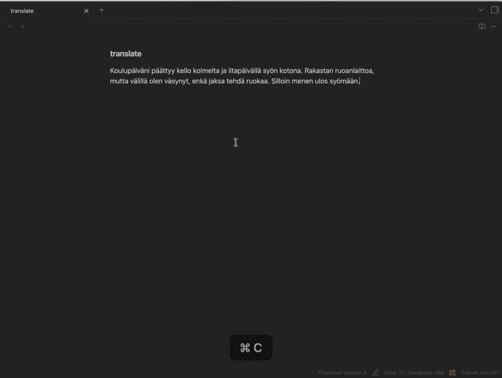
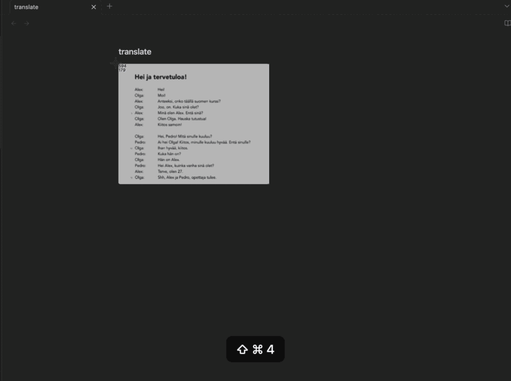

# AbubTranslate

Select text in any macOS app, press `⌥⇧T`, read the translation.

Runs on Apple Translation — on device, no key, no network. Plug in DeepL,
Google, Azure, Yandex, LibreTranslate, MyMemory or any OpenAI-compatible
server, including one running on your own machine.

  

[Читать по-русски](README.ru.md)



`⌥⇧S` does the same for an image in the clipboard — a screenshot, a photo of
a page — recognised on device by Apple Vision, no screen-recording permission:



## Install

```bash
brew trust abubiker/tap     # Homebrew 6+ only
brew tap Abubiker/tap
brew install --cask abubtranslate
```

Or [download AbubTranslate.dmg](https://github.com/Abubiker/AbubTranslate/releases/latest/download/AbubTranslate.dmg) — macOS 15+, Apple Silicon.

Not notarized either way, so the first launch goes through System Settings →
Privacy & Security → Open Anyway.

## Shortcuts

| | |
|---|---|
| `⌥⇧T` | translate the selection |
| `⌥⇧Y` | speak the last translation |
| `⌥⇧S` | translate an image from the clipboard |

## Engines

| Engine | Runs | What it needs |
|---|---|---|
| Apple Translation | on device | built in, 22 languages |
| MyMemory | cloud | no key, 5,000 chars/day (50,000 with an email) |
| Azure Translator | cloud | key; F0 tier is 2M chars/month free |
| Google Translate | cloud | key; paid past the free allowance |
| DeepL | cloud | key; one-time 1M character credit |
| OpenAI-compatible | cloud or local | URL and model; Ollama, LM Studio, proxies |
| Yandex Cloud Translate | cloud | service account key, billed per character from the first one |
| LibreTranslate | cloud or local | instance URL; your own in docker needs no key |

Apple, a local OpenAI-compatible server and a self-hosted LibreTranslate send
nothing anywhere. The rest send the text to a third-party server.

Where to get each key, and a button to test it, are in the app's settings.

## Permissions

Translating the selection needs Accessibility. If it is granted and still
does not work, a stale entry from an earlier build is in the way:

```bash
tccutil reset Accessibility com.opensource.abubtranslate
```

## License

GPL-3.0-only, full text in [LICENSE](LICENSE). A fork stays under GPL and
ships its sources. For use in a closed product there is a separate
commercial license — open an [issue](https://github.com/Abubiker/AbubTranslate/issues).

## Build

`./Scripts/build.sh` — that script, not bare `xcodebuild`. The comment at the
top of it explains why, and what to export before the first run.
